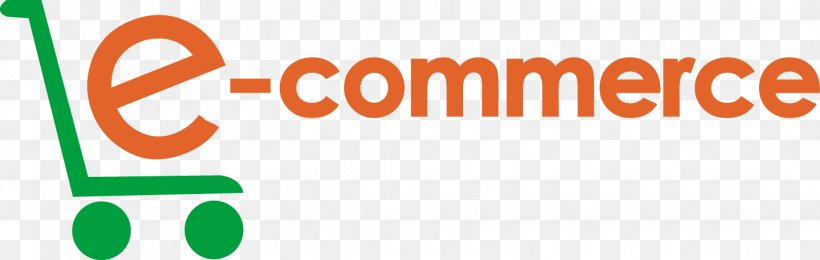

# E-Commerce Application



A modern e-commerce application built with React, TypeScript, Redux Toolkit, RTK Query, and Ant Design. This application provides a comprehensive solution for managing products with a beautiful, responsive interface.

## 📋 Features

### Product Management

- **Product List:** Browse all products with pagination support
- **Category Navigation:** Browse products by categories with a professional sidebar layout
- **Product Details:** View comprehensive product information including images, specifications, and reviews
- **Product Editing:** Modify product details with a user-friendly form interface

### User Experience

- **Responsive Design:** Fully responsive layout that works across devices
- **Skeleton Loading:** Professional loading states for all pages to improve perceived performance
- **Search Functionality:** Quick product search with dropdown suggestions
- **Fixed Navigation:** Persistent navbar for easier site navigation

## 🛠️ Technology Stack

- **Frontend Framework:** React with TypeScript
- **State Management:** Redux Toolkit
- **API Integration:** RTK Query for efficient data fetching and caching
- **UI Components:** Ant Design
- **Routing:** React Router v6
- **Build Tool:** Vite

## 🚀 Getting Started

### Prerequisites

- Node.js (v14+)
- npm or yarn

### Installation

1. Clone the repository

   ```bash
   git clone https://github.com/mdalaminfaraji/e-commerce-app.git
   cd e-commerce-app
   ```

2. Install dependencies

   ```bash
   npm install
   # or
   yarn install
   ```

3. Start the development server

   ```bash
   npm run dev
   # or
   yarn dev
   ```

4. Open your browser and navigate to http://localhost:5173

## 📁 Project Structure

```
src/
├── components/          # Reusable components
│   ├── skeletons/       # Skeleton loading components
│   ├── Navbar.tsx       # Site navigation
│   └── SearchBar.tsx    # Product search component
├── features/
│   └── products/        # Product feature module
│       └── services/    # RTK Query services
├── layouts/             # Layout components
├── pages/               # Page components
├── routes/              # Routing configuration
├── store/               # Redux store configuration
├── styles/              # CSS styles
└── types/               # TypeScript type definitions
```

## 🔌 API Integration

This application integrates with the following API endpoints from [DummyJSON](https://dummyjson.com/):

- Products List: `GET https://dummyjson.com/products`
- Product Details: `GET https://dummyjson.com/products/:id`
- Product Categories: `GET https://dummyjson.com/products/categories`
- Products by Category: `GET https://dummyjson.com/products/category/:category`
- Update Product: `PATCH https://dummyjson.com/products/:id`

## ✨ Future Enhancements

- User authentication and profile management
- Shopping cart functionality
- Checkout process
- Order history
- Product reviews and ratings
- Admin dashboard

## 👨‍💻 Author

**Md Alamin Faraji**
